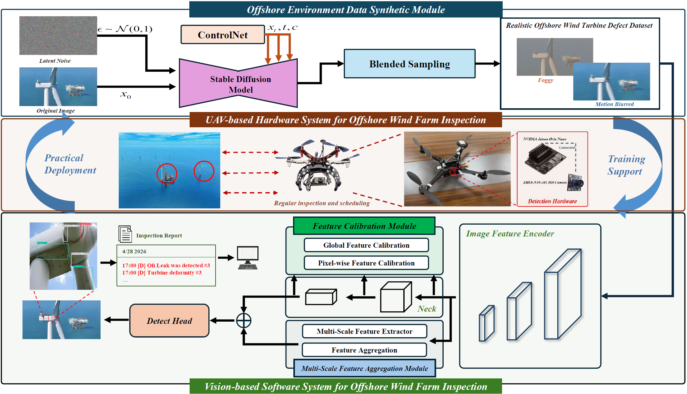

# IAS-26-ESC-0712

**A Vision-Based UAV Inspection System for Wind Turbine Blades in Offshore Extreme Environments**

> Wei Li, Shenwang Li, Yuyang Zhou, Yunwei Zhang, Junlong Deng, Zhenkang Zhang, Li Liu, and Thomas Wu  
> IEEE IAS Publications in Peer Review

[](#-license)
[](#-dataset)

---

## 📖 About

Offshore wind turbine blade inspection using UAVs faces three major challenges:

1. **Scarcity of field data** under realistic offshore conditions
2. **Limited adaptability** of existing methods to extreme environments (low-light, fog, wind-induced motion blur)
3. **Small-scale defect detection** difficulty

This work proposes a unified framework that integrates:

- **Diffusion-based data augmentation** — synthesizes all-time and extreme-environment scenarios from existing data
- **Multi-scale feature aggregation** — enhances small defect representation
- **Domain-adaptive detection** — learns environment-invariant features for robust detection

> This work presents the **first synthetic dataset** for offshore blade inspection under challenging conditions, and a new paradigm for overcoming data scarcity and environmental challenges in offshore wind infrastructure monitoring.

## ⚠️ Notice

> **This paper is currently under peer review (IEEE IAS Publications).**  
> - Code will be released publicly after paper acceptance.  
> - Only the **validation set** is provided here for reviewer access.  
> - Full dataset (training + test splits) will be released upon paper publication.


## 📊 Framework Overview



# Quick Start

## 📥 Download Dataset

Clone this repository to download the validation set locally:

```bash
git clone https://github.com/Welllee12366/IAS-26-ESC-0712.git
cd IAS-26-ESC-0712
```


## 📁 Project Structure

```
.
├── data/
│   └── WTVD/               # Wind Turbine Vision Dataset (val set only — see Notice)
│       ├── extreme/        # Extreme environment subset (val)
│       │   ├── images/
│       │   ├── labels/
│       │   └── extreme_data.yaml
│       └── original/       # Original conditions subset (val)
│           ├── images/
│           ├── labels/
│           └── original_data.yaml
├── Figures/
│   └── graph.png           # Visualization
├── .gitignore
└── LICENSE
```

**Dataset classes (7 defect types):** `burning`, `crack`, `deformity`, `dirt`, `oil`, `peeling`, `rusty`

## 🔧 Environment

```bash
pip install ultralytics
```

## 🔍 Validate Dataset

Validate that the dataset is correctly configured and the model can load it properly:

```bash
# Validate on original conditions
yolo detect val data=data/WTVD/original_data.yaml model=yolov8n.pt

# Validate on extreme environment subset
yolo detect val data=data/WTVD/extreme_data.yaml model=yolov8n.pt

# Validate with custom trained model (replace with your checkpoint path)
yolo detect val data=data/WTVD/extreme_data.yaml model=runs/detect/train/weights/best.pt
```

## 📜 License

- **Code:** **MIT License**
- **Dataset:** **CC BY 4.0** — The datasets and data files are made available under the [Creative Commons Attribution 4.0 International License](https://creativecommons.org/licenses/by/4.0/).

## � Citation

If this work is helpful for your research, please cite:

```bibtex
@article{li2026vision,
  title={A Vision-Based UAV Inspection System for Wind Turbine Blades in Offshore Extreme Environments},
  author={Li, Wei and Li, Shenwang and Zhou, Yuyang and Zhang, Yunwei and Deng, Junlong and Zhang, Zhenkang and Liu, Li and Wu, Thomas},
  journal={IEEE IAS Publications},
  year={2026}
}
```
